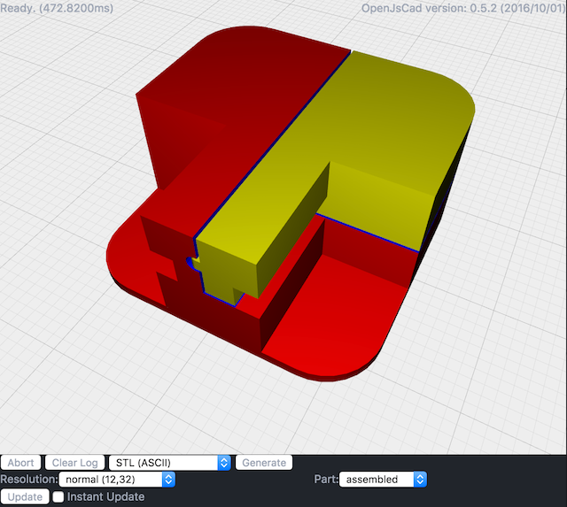

# meshboard-bracket

> brackets for a synapse meshboard

## Running

The jscad project `meshboard-bracket` uses gulp to create a `dist/meshboardBracket.jscad` file and watches your source for changes. You can drag the `dist/meshboardBracket.jscad` directory into the drop area on [openjscad.org](http://openjscad.org). Make sure you check `Auto Reload` and any time you save, gulp will recreate the `dist/meshboardBracket.jscad` file and your model should refresh.

## jscad-utils

The example project uses [jscad-utils](https://www.npmjs.com/package/jscad-utils). This is a set of utilities that make object creation and alignment easier. To remove it, `npm uninstall --save jscad-utils`.

## License

ISC © [John Cole](http://github.com/)
